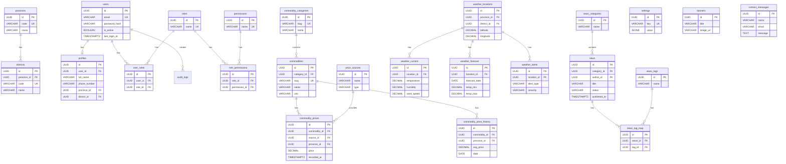

# Database ERD (Entity Relationship Diagram)

```mermaid
erDiagram
    %% Geography
    provinces ||--o{ districts : "has"
    provinces {
        UUID id PK
        VARCHAR code UK
        VARCHAR name
    }
    districts {
        UUID id PK
        UUID province_id FK
        VARCHAR code UK
        VARCHAR name
    }

    %% Users & Profiles
    users ||--o| profiles : "has"
    users ||--o{ user_roles : "has"
    users ||--o{ audit_logs : "creates"
    users {
        UUID id PK
        VARCHAR email UK
        VARCHAR password_hash
        BOOLEAN is_active
        TIMESTAMPTZ last_login_at
    }
    profiles {
        UUID id PK
        UUID user_id FK
        VARCHAR full_name
        VARCHAR phone_number
        UUID province_id FK
        UUID district_id FK
    }

    %% RBAC
    roles ||--o{ user_roles : "has"
    roles ||--o{ role_permissions : "has"
    permissions ||--o{ role_permissions : "has"
    roles {
        UUID id PK
        VARCHAR name UK
    }
    permissions {
        UUID id PK
        VARCHAR name UK
    }
    role_permissions {
        UUID id PK
        UUID role_id FK
        UUID permission_id FK
    }
    user_roles {
        UUID id PK
        UUID user_id FK
        UUID role_id FK
    }

    %% Commodities
    commodity_categories ||--o{ commodities : "contains"
    commodities ||--o{ commodity_prices : "has"
    commodities ||--o{ commodity_price_history : "has"
    price_sources ||--o{ commodity_prices : "provides"
    commodity_categories {
        UUID id PK
        VARCHAR slug UK
        VARCHAR name
    }
    commodities {
        UUID id PK
        UUID category_id FK
        VARCHAR slug UK
        VARCHAR name
        VARCHAR unit
    }
    price_sources {
        UUID id PK
        VARCHAR name
        VARCHAR type
    }
    commodity_prices {
        UUID id PK
        UUID commodity_id FK
        UUID source_id FK
        UUID province_id FK
        DECIMAL price
        TIMESTAMPTZ recorded_at
    }
    commodity_price_history {
        UUID id PK
        UUID commodity_id FK
        UUID province_id FK
        DECIMAL avg_price
        DATE date
    }

    %% Weather
    weather_locations ||--o{ weather_current : "has"
    weather_locations ||--o{ weather_forecast : "has"
    weather_locations ||--o{ weather_alerts : "has"
    weather_locations {
        UUID id PK
        UUID province_id FK
        UUID district_id FK
        DECIMAL latitude
        DECIMAL longitude
    }
    weather_current {
        UUID id PK
        UUID location_id FK
        DECIMAL temperature
        DECIMAL humidity
        DECIMAL wind_speed
    }
    weather_forecast {
        UUID id PK
        UUID location_id FK
        DATE forecast_date
        DECIMAL temp_min
        DECIMAL temp_max
    }
    weather_alerts {
        UUID id PK
        UUID location_id FK
        VARCHAR alert_type
        VARCHAR severity
    }

    %% News
    news_categories ||--o{ news : "contains"
    news ||--o{ news_tag_map : "has"
    news_tags ||--o{ news_tag_map : "has"
    news {
        UUID id PK
        UUID category_id FK
        UUID author_id FK
        VARCHAR title
        VARCHAR status
        TIMESTAMPTZ published_at
    }
    news_categories {
        UUID id PK
        VARCHAR name
    }
    news_tags {
        UUID id PK
        VARCHAR name
    }
    news_tag_map {
        UUID id PK
        UUID news_id FK
        UUID tag_id FK
    }

    %% Others
    settings {
        UUID id PK
        VARCHAR key UK
        JSONB value
    }
    banners {
        UUID id PK
        VARCHAR title
        VARCHAR image_url
    }
    contact_messages {
        UUID id PK
        VARCHAR name
        VARCHAR email
        TEXT message
    }
```
